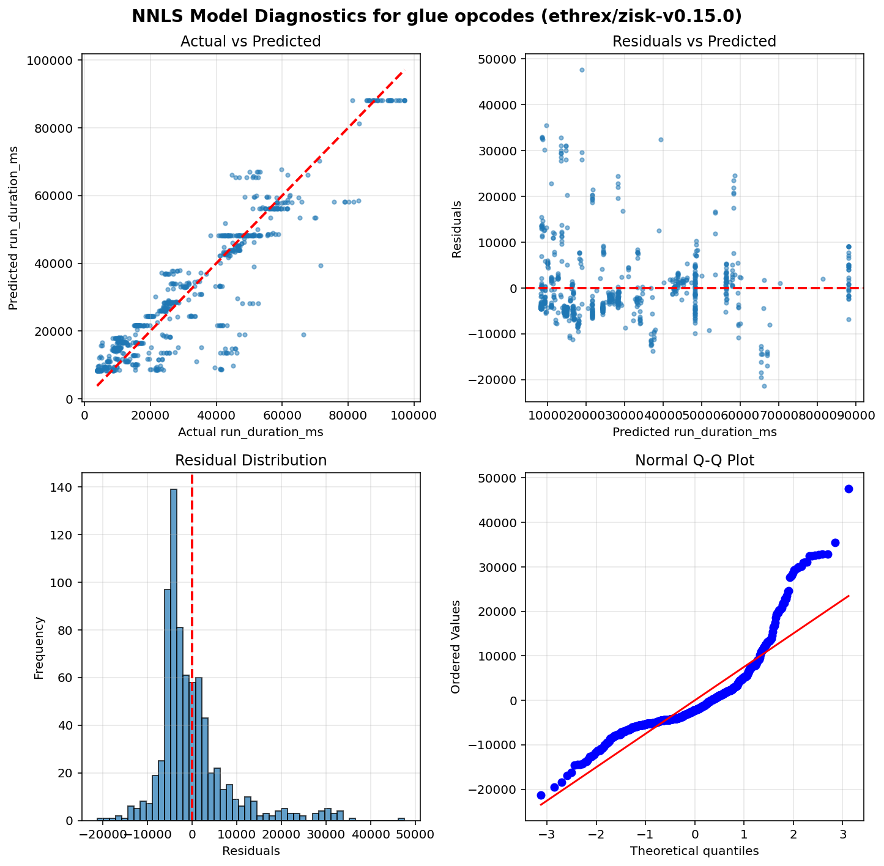
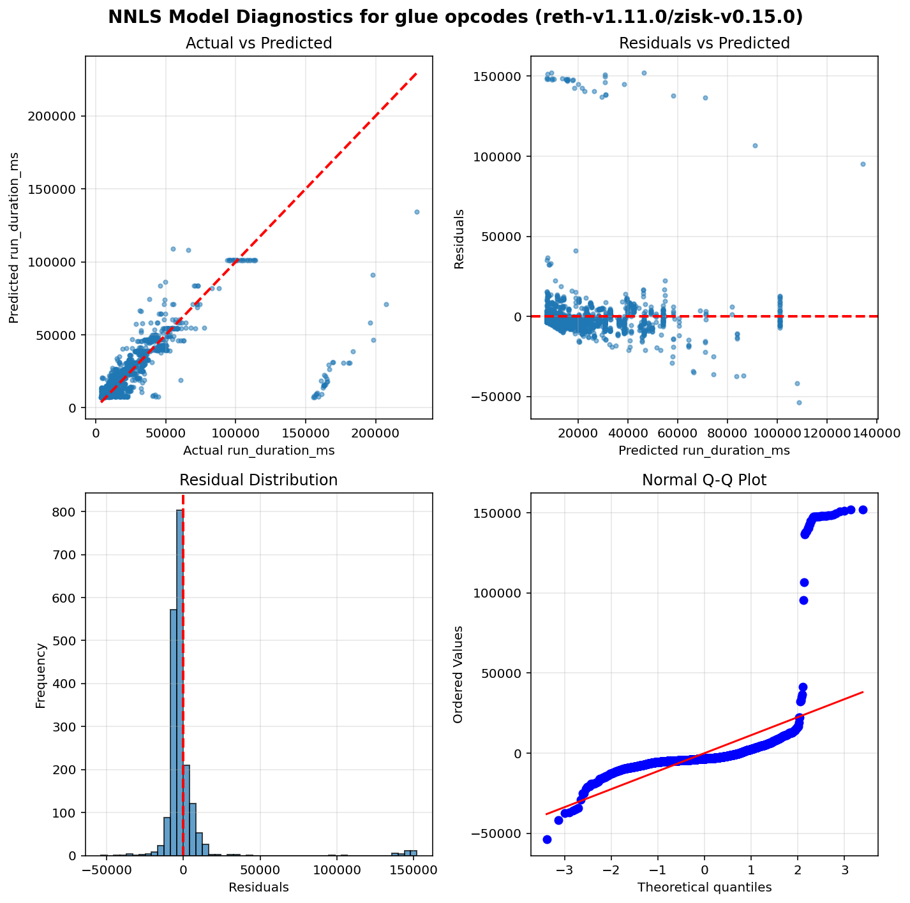
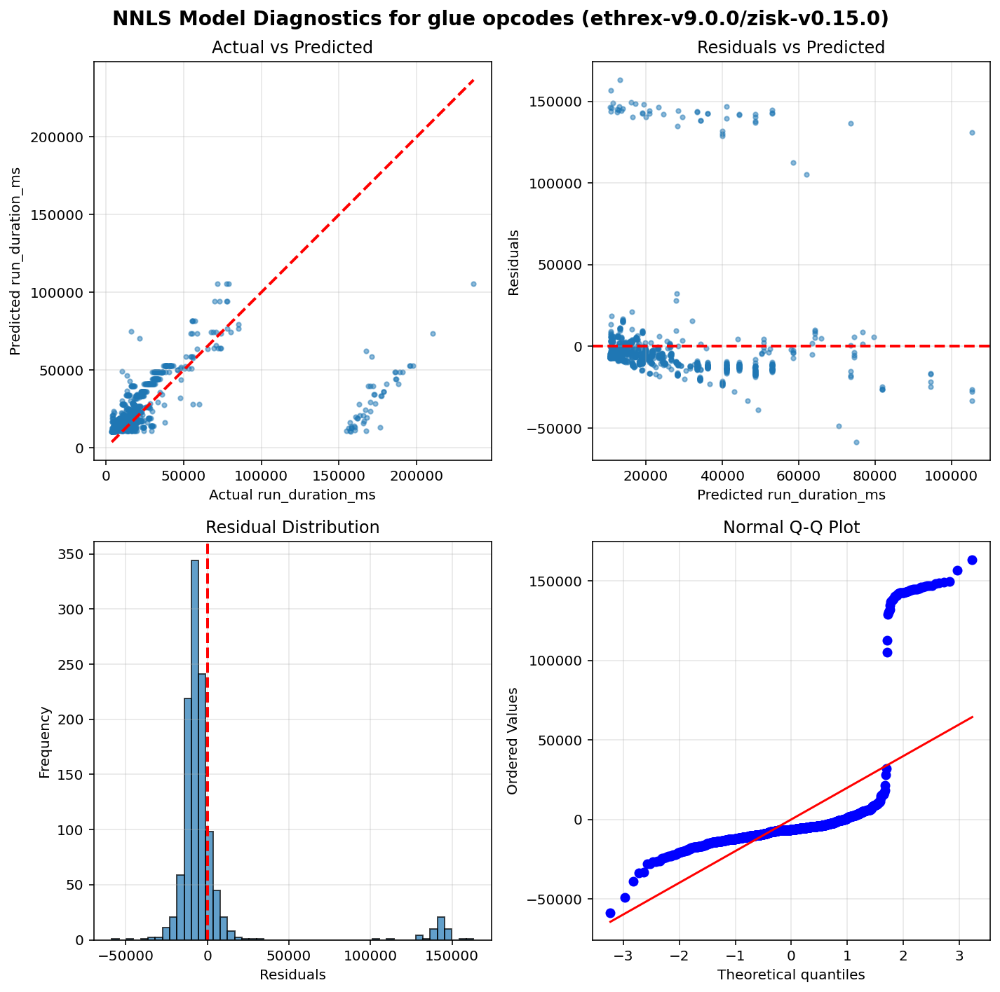

Operation run times estimation results - Glue opcodes
=====================================================

Table of contents
=================

* [ethrex/zisk-v0.15.0](#ethrexzisk-v0150)
* [reth-v1.11.0/zisk-v0.15.0](#reth-v1110zisk-v0150)
* [ethrex-v9.0.0/zisk-v0.15.0](#ethrex-v900zisk-v0150)

# Introduction


This is an automated report generated from the opcode run times
estimation script `./src/glue.py`. The script
uses data generated by running the
[EEST benchmark suite](https://github.com/ethereum/execution-spec-tests/tree/main/tests/benchmark)
with the [Nethermind benchmarking tooling](https://github.com/NethermindEth/gas-benchmarks).

The data includes all the tests for glue operations repriced in EIP-zkevm run
between 2026-02-06 and 2026-03-11.

## What is a glue opcode?


A **glue opcode** is an opcode whose execution count scales proportionally with the count of
a target opcode under test. Concretely, an opcode is classified as a glue opcode for a given
test if its execution count has a Pearson correlation ≥ 0.95 with the target opcode count
across different test parameter values, and its average count per target opcode execution
is at least 0.0005. Self-correlations are excluded. This identification is done automatically
from opcode-level execution traces.

The glue opcode set is also expanded transitively: if opcode A is a glue opcode for a target,
and opcode B is a glue opcode for A, then B is also included. This captures indirect
dependencies in the benchmark scaffolding.

**Why do glue opcodes matter?**

Because glue opcodes scale with the target opcode count, their runtime is absorbed into the
slope coefficient when regressing total test execution time on target opcode count. Without
correction, the slope overestimates the target opcode's per-execution runtime. The glue opcode
runtimes estimated in this report are used to compute a **glue adjustment** — a correction
subtracted from each target opcode's slope to remove the contribution of glue opcodes.

## How glue opcode runtimes are estimated?


**Non-Negative Least Squares (NNLS) Linear Regression** is used to estimate glue operation runtimes.
This model ensures all coefficients are non-negative, which is physically meaningful since
execution time cannot be negative.

Unlike the per-opcode models used for target operations, glue opcodes are estimated using a
**single model per client** that fits all glue opcode counts as features simultaneously. This means
the model estimates the runtime coefficients of all glue opcodes at the same time by solving:

`runtime = intercept + coef_1 × opcode_1_count + coef_2 × opcode_2_count + ... + coef_n × opcode_n_count`

where each `coef_i` represents the estimated per-execution runtime of the corresponding glue opcode.
This joint estimation approach accounts for correlations between glue opcode counts across tests,
producing more accurate estimates than fitting each glue opcode independently.

Only warm CALL variants are included in the model (cold CALL tests are excluded).

## Model Quality Metrics


Each model reports two key metrics to assess the quality of the fit:

**R² (R-squared / Coefficient of Determination)**
- Ranges from 0 to 1 (or can be negative for very poor fits)
- Measures how well the model explains the variance in the data
- **Interpretation**:
  - R² > 0.9: Excellent fit - the model explains >90% of the variance
  - R² > 0.7: Good fit - the model captures most of the relationship
  - R² > 0.5: Acceptable fit - the model has predictive power but notable variance remains
  - R² < 0.5: Poor fit - the model may not be reliable

**p-value**
- Tests the statistical significance of each coefficient, based on a bootstrap sample estimation
- **Interpretation**:
  - p < 0.05: Statistically significant - the parameter has a real effect on runtime
  - p ≥ 0.05: Not significant - the parameter's effect cannot be distinguished from random noise

We also plot some diagnostic graphs for each operation and client combination to visually assess the model fit.

# ethrex/zisk-v0.15.0


```python
==============================================================================
                           NNLS Regression Results                            
==============================================================================
Dep. Variable:          run_duration_ms              R-squared:          0.856
Model:                  NNLS                    Adj. R-squared:          0.847
No. Observations:       763                               RMSE:        8300.39
Df Residuals:           716                                MAE:        5640.58
Df Model:               46     
==============================================================================
                      coef     std err     P-value      [0.025      0.975]
------------------------------------------------------------------------------
         const   8351.8509   3399.2762       0.047      0.0000   9048.4025
         MSIZE      0.0014      0.0003       0.032      0.0000      0.0015
          CALL      0.4056      0.0115       0.000      0.3886      0.4332
    STATICCALL      0.4052      0.0210       0.002      0.3876      0.4281
         DUP12      0.0015      0.0776       0.088      0.0000      0.3528
          STOP      0.0045      0.0148       0.202      0.0000      0.0237
      CODECOPY      0.0059      0.0014       0.000      0.0037      0.0089
           GAS      0.0016      0.0009       0.001      0.0013      0.0050
          DUP6      0.0015      0.0700       0.051      0.0000      0.0016
          DUP4      0.0015      0.0884       0.072      0.0000      0.3587
RETURNDATASIZE      0.0014      0.0004       0.007      0.0003      0.0024
         DUP15      0.0016      0.0659       0.075      0.0000      0.1449
         PUSH3      0.0026      0.5480       0.034      0.0000      0.0028
           SHL      0.0057      0.0020       0.127      0.0000      0.0068
        MSTORE      0.0106      0.0011       0.000      0.0089      0.0122
         DUP16      0.0015      0.0745       0.093      0.0000      0.3449
      JUMPDEST      0.0012      0.3524       0.004      0.0008      0.0072
  CALLDATASIZE      0.0013      0.0001       0.000      0.0012      0.0014
   SELFBALANCE      0.0131      0.2547       0.090      0.0000      1.3910
           POP      0.0010      0.0004       0.047      0.0000      0.0021
         PUSH2      0.0027      0.0042       0.000      0.0023      0.0197
          DUP5      0.0015      0.0716       0.019      0.0001      0.2548
         DUP11      0.0015      0.0802       0.047      0.0000      0.0017
  CALLDATACOPY      0.0057      0.0013       0.000      0.0044      0.0087
          JUMP      0.0052      1.0321       0.159      0.0000      1.0051
          DUP2      0.0007      0.0005       0.232      0.0000      0.0015
        RETURN      0.0346      0.0313       0.100      0.0000      0.0986
         PUSH1      0.0012      0.0006       0.243      0.0000      0.0017
          DUP7      0.0016      0.0654       0.053      0.0000      0.0017
  CALLDATALOAD      0.0000      0.1538       1.000      0.0000      0.4860
          DUP3      0.0015      0.0455       0.040      0.0000      0.0016
        PUSH32      0.0085   1493.4946       0.000      0.0082   3540.7044
        CREATE      3.9542      2.7713       0.401      0.0000      8.7208
        PUSH20      0.0060      0.0432       0.081      0.0000      0.0500
           MOD      0.0070      0.0055       0.013      0.0020      0.0244
         PUSH0      0.0014      0.0004       0.027      0.0000      0.0023
         MLOAD      0.0105      0.0007       0.000      0.0092      0.0120
         DUP13      0.0015      0.0675       0.065      0.0000      0.0016
       MSTORE8      0.0046      0.0011       0.000      0.0030      0.0062
          DUP9      0.0015      0.0646       0.055      0.0000      0.2581
           ADD      0.0028     48.2122       0.093      0.0000      0.0038
           AND      0.0037      0.0009       0.014      0.0011      0.0051
          DUP1      0.0013      0.0005       0.038      0.0000      0.0020
         DUP14      0.0015      0.0681       0.036      0.0000      0.0018
          DUP8      0.0014      0.0602       0.062      0.0000      0.0056
         DUP10      0.0015      0.0498       0.090      0.0000      0.0016
            PC      0.0014      0.0008       0.044      0.0000      0.0015
==============================================================================
Notes: Non-negative least squares with bootstrap inference (1000 iterations)
==============================================================================
```




# reth-v1.11.0/zisk-v0.15.0


```python
==============================================================================
                           NNLS Regression Results                            
==============================================================================
Dep. Variable:          run_duration_ms              R-squared:          0.431
Model:                  NNLS                    Adj. R-squared:          0.417
No. Observations:       1964                              RMSE:       19958.05
Df Residuals:           1917                               MAE:        7265.83
Df Model:               46     
==============================================================================
                      coef     std err     P-value      [0.025      0.975]
------------------------------------------------------------------------------
         const   7345.5578    691.0915       0.000   6054.9742   8675.9465
         MSIZE      0.0009      0.0002       0.011      0.0005      0.0011
          CALL      0.1522      0.0206       0.000      0.1008      0.1848
    STATICCALL      0.1975      0.0173       0.000      0.1671      0.2354
         DUP12      0.0021      0.0035       0.002      0.0004      0.0121
          STOP      0.1043      0.0336       0.000      0.0494      0.1804
      CODECOPY      0.0064      0.0017       0.003      0.0027      0.0100
           GAS      0.0009      0.0003       0.055      0.0000      0.0011
          DUP6      0.0009      0.0003       0.013      0.0001      0.0011
          DUP4      0.0009      0.0050       0.013      0.0001      0.0011
RETURNDATASIZE      0.0010      0.0003       0.003      0.0003      0.0013
         DUP15      0.0009      0.0025       0.003      0.0002      0.0011
         PUSH3      0.0015      0.2370       0.002      0.0007      0.0017
           SHL      0.0027      0.0007       0.007      0.0007      0.0036
        MSTORE      0.0120      0.0008       0.000      0.0103      0.0137
         DUP16      0.0009      0.0058       0.013      0.0001      0.0012
      JUMPDEST      0.0005      0.0001       0.004      0.0003      0.0006
  CALLDATASIZE      0.0013      0.0001       0.000      0.0010      0.0015
   SELFBALANCE      0.0380      0.1004       0.003      0.0294      0.0413
           POP      0.0006      0.0003       0.005      0.0002      0.0015
         PUSH2      0.0011      0.0004       0.002      0.0005      0.0016
          DUP5      0.0009      0.0036       0.009      0.0002      0.0012
         DUP11      0.0009      0.0044       0.009      0.0002      0.0011
  CALLDATACOPY      0.0056      0.0007       0.000      0.0042      0.0070
          JUMP      0.0000      0.0421       0.566      0.0000      0.0030
          DUP2      0.0010      0.0004       0.017      0.0002      0.0019
        RETURN      0.0333      0.0216       0.102      0.0000      0.0761
         PUSH1      0.0003      0.0003       0.344      0.0000      0.0009
          DUP7      0.0009      0.0084       0.009      0.0001      0.0011
  CALLDATALOAD      0.0000      0.2264       1.000      0.0000      0.7639
          DUP3      0.0009      0.0028       0.006      0.0002      0.0011
        PUSH32      0.0158     23.3158       0.012      0.0027      0.0256
        CREATE      6.8840      2.3072       0.001      2.6891     11.6418
        PUSH20      0.0102      0.0050       0.001      0.0039      0.0209
           MOD      0.0117      0.0014       0.000      0.0089      0.0140
         PUSH0      0.0014      0.0005       0.000      0.0010      0.0028
         MLOAD      0.0065      0.0021       0.024      0.0002      0.0090
         DUP13      0.0009      0.0045       0.007      0.0001      0.0011
       MSTORE8      0.0018      0.0008       0.041      0.0000      0.0033
          DUP9      0.0009      0.0003       0.008      0.0002      0.0011
           ADD      0.0013      0.0006       0.158      0.0000      0.0020
           AND      0.0020      0.0005       0.000      0.0013      0.0031
          DUP1      0.0022      0.0021       0.056      0.0000      0.0084
         DUP14      0.0009      0.0003       0.008      0.0002      0.0012
          DUP8      0.0008      0.0002       0.006      0.0002      0.0010
         DUP10      0.0009      0.0025       0.007      0.0002      0.0011
            PC      0.0021      0.0022       0.003      0.0005      0.0092
==============================================================================
Notes: Non-negative least squares with bootstrap inference (1000 iterations)
==============================================================================
```




# ethrex-v9.0.0/zisk-v0.15.0


```python
==============================================================================
                           NNLS Regression Results                            
==============================================================================
Dep. Variable:          run_duration_ms              R-squared:          0.197
Model:                  NNLS                    Adj. R-squared:          0.163
No. Observations:       1129                              RMSE:       31295.29
Df Residuals:           1082                               MAE:       13932.50
Df Model:               46     
==============================================================================
                      coef     std err     P-value      [0.025      0.975]
------------------------------------------------------------------------------
         const  10758.2692   1465.6547       0.000   7620.0590  13443.0771
         MSIZE      0.0016      0.0016       0.039      0.0000      0.0056
          CALL      0.3189      0.0546       0.000      0.2066      0.4208
    STATICCALL      0.3733      0.0440       0.000      0.2879      0.4668
         DUP12      0.0002      0.0304       0.288      0.0000      0.0008
          STOP      0.1895      0.0985       0.001      0.0314      0.4111
      CODECOPY      0.0029      0.0009       0.006      0.0011      0.0046
           GAS      0.0010      0.0011       0.010      0.0001      0.0042
          DUP6      0.0001      0.0405       0.415      0.0000      0.0008
          DUP4      0.0001      0.0334       0.322      0.0000      0.0007
RETURNDATASIZE      0.0047      0.0026       0.126      0.0000      0.0081
         DUP15      0.0001      0.0309       0.366      0.0000      0.0007
         PUSH3      0.0010      2.4883       0.054      0.0000      0.0015
           SHL      0.0016      0.0013       0.131      0.0000      0.0042
        MSTORE      0.0097      0.0031       0.000      0.0050      0.0168
         DUP16      0.0001      0.0380       0.333      0.0000      0.0008
      JUMPDEST      0.0008      0.0002       0.045      0.0000      0.0010
  CALLDATASIZE      0.0010      0.0007       0.010      0.0001      0.0025
   SELFBALANCE      0.0131      0.0008       0.000      0.0112      0.0144
           POP      0.0000      0.0022       1.000      0.0000      0.0069
         PUSH2      0.0005      0.0007       0.087      0.0000      0.0018
          DUP5      0.0002      0.0450       0.317      0.0000      0.0012
         DUP11      0.0001      0.0484       0.334      0.0000      0.0008
  CALLDATACOPY      0.0059      0.0025       0.003      0.0017      0.0114
          JUMP      0.0021      0.9942       0.150      0.0000      0.0045
          DUP2      0.0020      0.0012       0.265      0.0000      0.0037
        RETURN      0.0000      0.0207       1.000      0.0000      0.0688
         PUSH1      0.0003      0.0003       0.192      0.0000      0.0009
          DUP7      0.0003      0.0298       0.278      0.0000      0.0009
  CALLDATALOAD      0.0000      0.1973       1.000      0.0000      0.3195
          DUP3      0.0000      0.0347       0.470      0.0000      0.0007
        PUSH32      0.0082     55.3511       0.009      0.0037      0.0090
        CREATE     13.0466     12.3183       0.139      0.0000     41.6025
        PUSH20      0.0048      0.0045       0.010      0.0014      0.0057
           MOD      0.0084      0.0047       0.014      0.0007      0.0190
         PUSH0      0.0002      0.0002       0.259      0.0000      0.0006
         MLOAD      0.0135      0.0029       0.000      0.0057      0.0170
         DUP13      0.0001      0.0477       0.376      0.0000      0.0009
       MSTORE8      0.0000      0.0016       1.000      0.0000      0.0047
          DUP9      0.0000      0.0296       0.478      0.0000      0.0006
           ADD      0.0000      0.0004       1.000      0.0000      0.0014
           AND      0.0028      0.0020       0.074      0.0000      0.0075
          DUP1      0.0000      0.0003       1.000      0.0000      0.0007
         DUP14      0.0077      0.0302       0.155      0.0000      0.0245
          DUP8      0.0001      0.0347       0.387      0.0000      0.0008
         DUP10      0.0001      0.0324       0.381      0.0000      0.0007
            PC      0.0004      0.0002       0.105      0.0000      0.0007
==============================================================================
Notes: Non-negative least squares with bootstrap inference (1000 iterations)
==============================================================================
```



