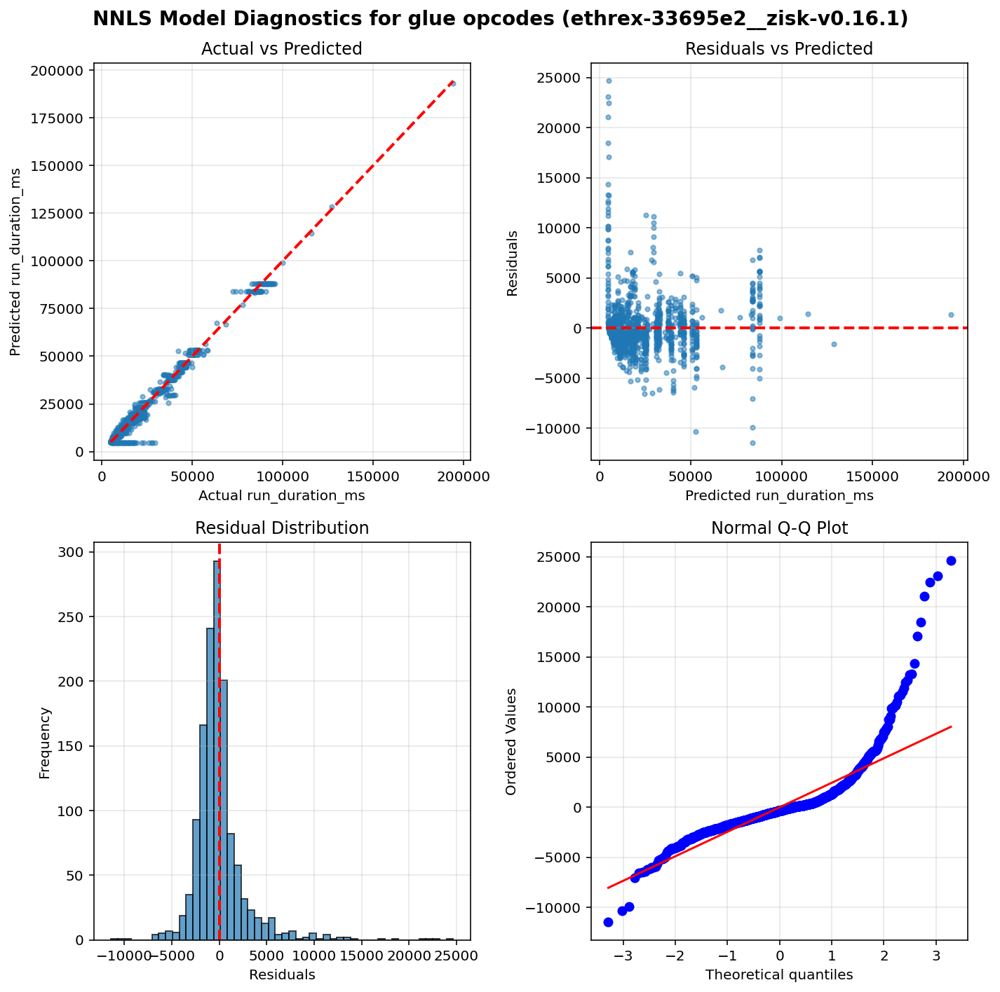
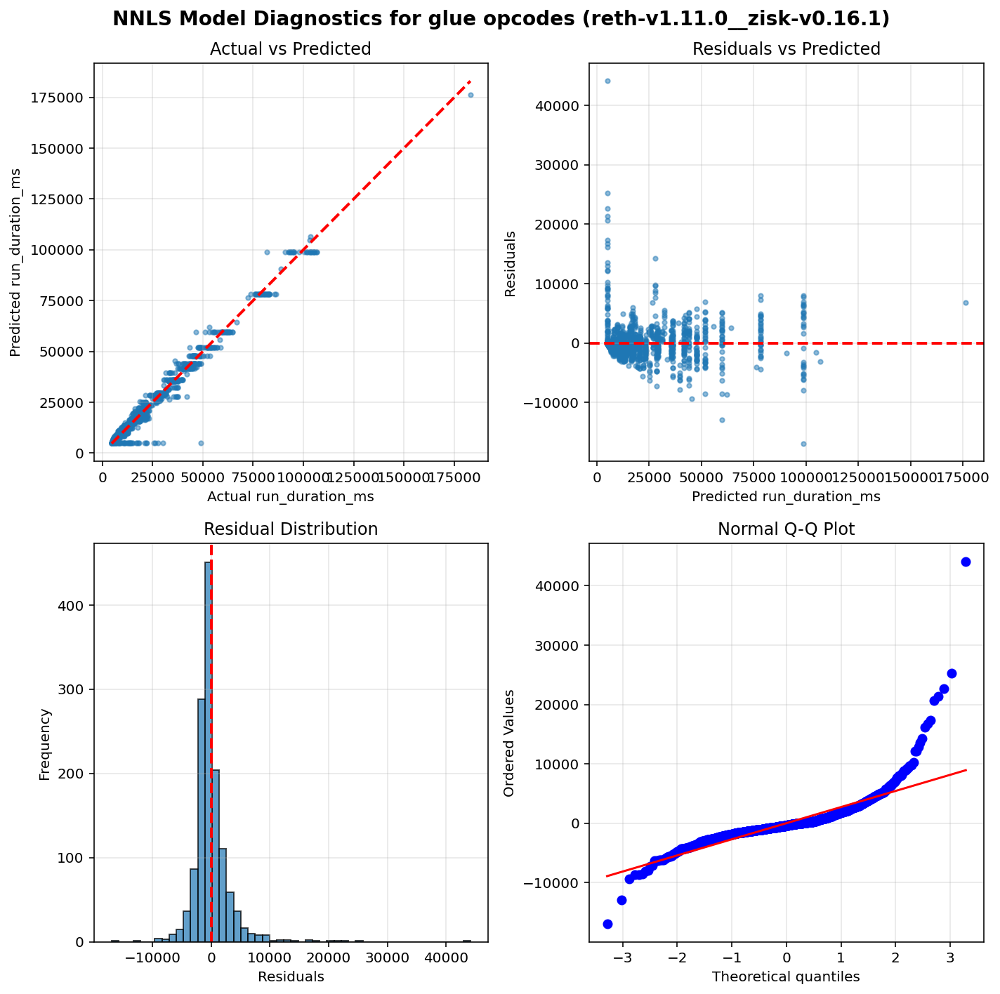

Operation run times estimation results - Glue opcodes
=====================================================

Table of contents
=================

* [ethrex-33695e2__zisk-v0.16.1](#ethrex-33695e2__zisk-v0161)
* [reth-v1.11.0__zisk-v0.16.1](#reth-v1110__zisk-v0161)

# Introduction


This is an automated report generated from the opcode run times
estimation script `./src/glue.py`. The script
uses data generated by running the
[EEST benchmark suite](https://github.com/ethereum/execution-spec-tests/tree/main/tests/benchmark)
with the [Nethermind benchmarking tooling](https://github.com/NethermindEth/gas-benchmarks).

The data includes all the tests for glue operations repriced in EIP-zkevm run
between 2026-03-30 and 2026-04-10.

## What is a glue opcode?


A **glue opcode** is an opcode whose execution count scales proportionally with the count of
a target opcode under test. Concretely, an opcode is classified as a glue opcode for a given
test if its execution count has a Pearson correlation ≥ 0.95 with the target opcode count
across different test parameter values, and its average count per target opcode execution
is at least 0.0005. Self-correlations are excluded. This identification is done automatically
from opcode-level execution traces.

The glue opcode set is also expanded transitively: if opcode A is a glue opcode for a target,
and opcode B is a glue opcode for A, then B is also included. This captures indirect
dependencies in the benchmark scaffolding.

**Why do glue opcodes matter?**

Because glue opcodes scale with the target opcode count, their runtime is absorbed into the
slope coefficient when regressing total test execution time on target opcode count. Without
correction, the slope overestimates the target opcode's per-execution runtime. The glue opcode
runtimes estimated in this report are used to compute a **glue adjustment** — a correction
subtracted from each target opcode's slope to remove the contribution of glue opcodes.

## How glue opcode runtimes are estimated?


**Non-Negative Least Squares (NNLS) Linear Regression** is used to estimate glue operation runtimes.
This model ensures all coefficients are non-negative, which is physically meaningful since
execution time cannot be negative.

Unlike the per-opcode models used for target operations, glue opcodes are estimated using a
**single model per client** that fits all glue opcode counts as features simultaneously. This means
the model estimates the runtime coefficients of all glue opcodes at the same time by solving:

`runtime = intercept + coef_1 × opcode_1_count + coef_2 × opcode_2_count + ... + coef_n × opcode_n_count`

where each `coef_i` represents the estimated per-execution runtime of the corresponding glue opcode.
This joint estimation approach accounts for correlations between glue opcode counts across tests,
producing more accurate estimates than fitting each glue opcode independently.

Only warm CALL variants are included in the model (cold CALL tests are excluded).

## Model Quality Metrics


Each model reports two key metrics to assess the quality of the fit:

**R² (R-squared / Coefficient of Determination)**
- Ranges from 0 to 1 (or can be negative for very poor fits)
- Measures how well the model explains the variance in the data
- **Interpretation**:
  - R² > 0.9: Excellent fit - the model explains >90% of the variance
  - R² > 0.7: Good fit - the model captures most of the relationship
  - R² > 0.5: Acceptable fit - the model has predictive power but notable variance remains
  - R² < 0.5: Poor fit - the model may not be reliable

**p-value**
- Tests the statistical significance of each coefficient, based on a bootstrap sample estimation
- **Interpretation**:
  - p < 0.05: Statistically significant - the parameter has a real effect on runtime
  - p ≥ 0.05: Not significant - the parameter's effect cannot be distinguished from random noise

We also plot some diagnostic graphs for each operation and client combination to visually assess the model fit.

# ethrex-33695e2__zisk-v0.16.1


```python
==============================================================================
                           NNLS Regression Results                            
==============================================================================
Dep. Variable:          run_duration_ms              R-squared:          0.981
Model:                  NNLS                    Adj. R-squared:          0.981
No. Observations:       1356                              RMSE:        2808.08
Df Residuals:           1323                               MAE:        1651.70
Df Model:               32     
==============================================================================
                      coef     std err     P-value      [0.025      0.975]
------------------------------------------------------------------------------
         const   4720.9298    167.2012       0.000   4421.0496   5091.5017
         DUP10      0.0014      0.0001       0.000      0.0013      0.0014
          DUP5      0.0014      0.0001       0.000      0.0012      0.0014
  CALLDATALOAD      0.1809      0.0673       0.004      0.0421      0.3106
         PUSH1      0.0016      0.0002       0.000      0.0015      0.0021
      JUMPDEST      0.0006      0.0000       0.000      0.0006      0.0007
         PUSH2      0.0022      0.0001       0.000      0.0020      0.0022
          DUP6      0.0014      0.0001       0.000      0.0012      0.0015
         PUSH0      0.0012      0.0001       0.003      0.0009      0.0013
           GAS      0.0017      0.0002       0.000      0.0015      0.0022
          DUP7      0.0013      0.0001       0.000      0.0012      0.0014
          DUP2      0.0013      0.0002       0.006      0.0007      0.0015
           ADD      0.0019      0.0005       0.000      0.0014      0.0032
  CALLDATASIZE      0.0013      0.0001       0.000      0.0012      0.0013
    STATICCALL      0.0000      0.0577       1.000      0.0000      0.0000
         MLOAD      0.0098      0.0001       0.000      0.0095      0.0099
  CALLDATACOPY      0.0020      0.0004       0.010      0.0010      0.0024
          JUMP      0.0017      0.0008       0.000      0.0007      0.0037
        MSTORE      0.0092      0.0004       0.000      0.0088      0.0105
         DUP14      0.0014      0.0001       0.000      0.0013      0.0015
         DUP11      0.0014      0.0001       0.000      0.0012      0.0014
        PUSH20      0.0064      0.0001       0.000      0.0063      0.0066
         DUP15      0.0014      0.0001       0.000      0.0012      0.0016
          DUP3      0.0015      0.0001       0.000      0.0012      0.0016
        PUSH32      0.0099      0.0002       0.000      0.0093      0.0100
         DUP16      0.0014      0.0001       0.000      0.0012      0.0015
          DUP4      0.0014      0.0001       0.001      0.0012      0.0014
          DUP9      0.0014      0.0001       0.000      0.0013      0.0015
          DUP1      0.0013      0.0001       0.000      0.0012      0.0016
         DUP13      0.0014      0.0001       0.001      0.0012      0.0015
          DUP8      0.0014      0.0001       0.000      0.0012      0.0015
           POP      0.0000      0.0000       1.000      0.0000      0.0000
         DUP12      0.0014      0.0001       0.001      0.0012      0.0014
==============================================================================
Notes: Non-negative least squares with bootstrap inference (1000 iterations)
==============================================================================
```




# reth-v1.11.0__zisk-v0.16.1


```python
==============================================================================
                           NNLS Regression Results                            
==============================================================================
Dep. Variable:          run_duration_ms              R-squared:          0.978
Model:                  NNLS                    Adj. R-squared:          0.977
No. Observations:       1360                              RMSE:        3156.26
Df Residuals:           1327                               MAE:        1831.00
Df Model:               32     
==============================================================================
                      coef     std err     P-value      [0.025      0.975]
------------------------------------------------------------------------------
         const   4897.1868    241.1594       0.001   4571.9340   5290.8584
         DUP10      0.0011      0.0001       0.000      0.0008      0.0011
          DUP5      0.0011      0.0001       0.000      0.0009      0.0012
  CALLDATALOAD      0.0309      0.0497       0.384      0.0000      0.1607
         PUSH1      0.0012      0.0001       0.000      0.0010      0.0013
      JUMPDEST      0.0006      0.0000       0.000      0.0005      0.0006
         PUSH2      0.0012      0.3078       0.000      0.0010      0.0013
          DUP6      0.0010      0.0001       0.000      0.0008      0.0011
         PUSH0      0.0011      0.0001       0.000      0.0009      0.0011
           GAS      0.0014      0.0002       0.000      0.0012      0.0019
          DUP7      0.0010      0.0001       0.000      0.0009      0.0011
          DUP2      0.0010      0.0001       0.000      0.0007      0.0011
           ADD      0.0013      0.0001       0.000      0.0010      0.0015
  CALLDATASIZE      0.0013      0.0000       0.000      0.0013      0.0013
    STATICCALL      0.0000      0.0196       1.000      0.0000      0.0000
         MLOAD      0.0087      0.0001       0.000      0.0085      0.0089
  CALLDATACOPY      0.0026      0.0003       0.000      0.0022      0.0032
          JUMP      0.0007      0.0002       0.000      0.0004      0.0011
        MSTORE      0.0121      0.0002       0.000      0.0118      0.0127
         DUP14      0.0011      0.0001       0.000      0.0008      0.0011
         DUP11      0.0011      0.0001       0.000      0.0008      0.0012
        PUSH20      0.0053      0.0001       0.000      0.0051      0.0056
         DUP15      0.0011      0.0001       0.000      0.0009      0.0011
          DUP3      0.0011      0.0001       0.000      0.0009      0.0012
        PUSH32      0.0090     68.8272       0.000      0.0082      0.0093
         DUP16      0.0011      0.0001       0.000      0.0008      0.0011
          DUP4      0.0011      0.0001       0.001      0.0008      0.0012
          DUP9      0.0011      0.0001       0.000      0.0009      0.0011
          DUP1      0.0011      0.0001       0.000      0.0010      0.0012
         DUP13      0.0011      0.0001       0.001      0.0009      0.0011
          DUP8      0.0011      0.0001       0.000      0.0008      0.0012
           POP      0.0000      0.0000       1.000      0.0000      0.0000
         DUP12      0.0011      0.0001       0.000      0.0009      0.0012
==============================================================================
Notes: Non-negative least squares with bootstrap inference (1000 iterations)
==============================================================================
```



