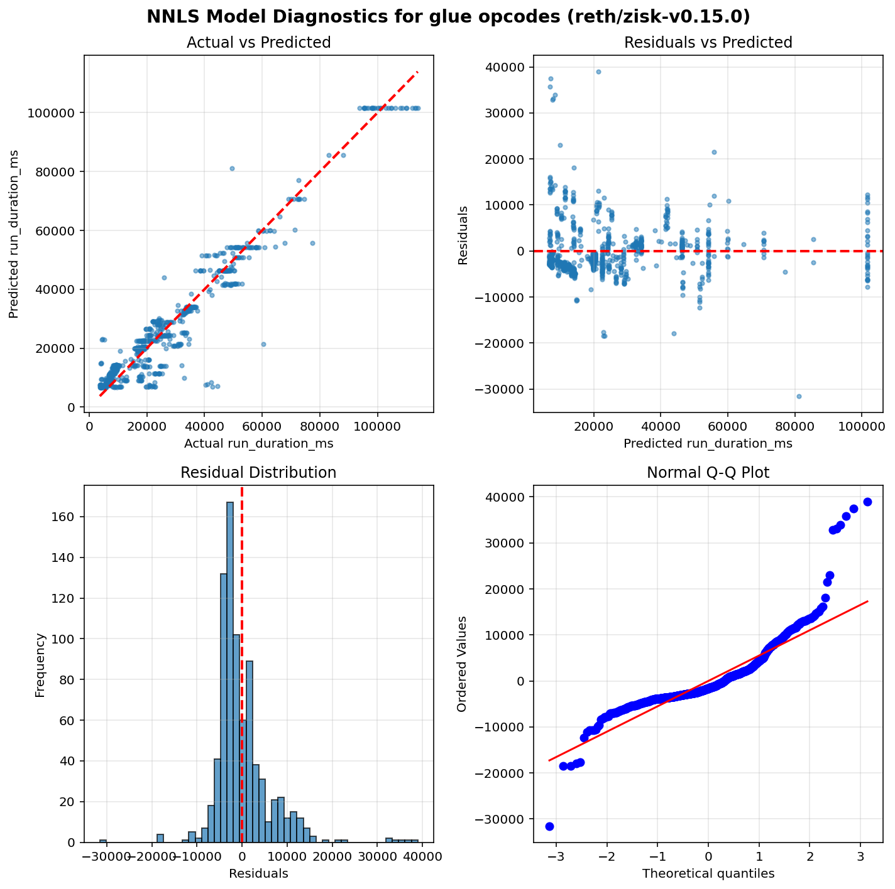

Operation run times estimation results - Glue opcodes
=====================================================

Table of contents
=================

* [ethrex/zisk-v0.15.0](#ethrexzisk-v0150)
* [reth/zisk-v0.15.0](#rethzisk-v0150)

# Introduction


This is an automated report generated from the opcode run times
estimation script `./src/glue.py`. The script
uses data generated by running the
[EEST benchmark suite](https://github.com/ethereum/execution-spec-tests/tree/main/tests/benchmark)
with the [Nethermind benchmarking tooling](https://github.com/NethermindEth/gas-benchmarks).

The data includes all the tests for glue operations repriced in EIP-zkevm run
between 2026-02-06 and 2026-02-10.

## What is a glue opcode?


A **glue opcode** is an opcode whose execution count scales proportionally with the count of
a target opcode under test. Concretely, an opcode is classified as a glue opcode for a given
test if its execution count has a Pearson correlation ≥ 0.95 with the target opcode count
across different test parameter values, and its average count per target opcode execution
is at least 0.0005. Self-correlations are excluded. This identification is done automatically
from opcode-level execution traces.

The glue opcode set is also expanded transitively: if opcode A is a glue opcode for a target,
and opcode B is a glue opcode for A, then B is also included. This captures indirect
dependencies in the benchmark scaffolding.

**Why do glue opcodes matter?**

Because glue opcodes scale with the target opcode count, their runtime is absorbed into the
slope coefficient when regressing total test execution time on target opcode count. Without
correction, the slope overestimates the target opcode's per-execution runtime. The glue opcode
runtimes estimated in this report are used to compute a **glue adjustment** — a correction
subtracted from each target opcode's slope to remove the contribution of glue opcodes.

## How glue opcode runtimes are estimated?


**Non-Negative Least Squares (NNLS) Linear Regression** is used to estimate glue operation runtimes.
This model ensures all coefficients are non-negative, which is physically meaningful since
execution time cannot be negative.

Unlike the per-opcode models used for target operations, glue opcodes are estimated using a
**single model per client** that fits all glue opcode counts as features simultaneously. This means
the model estimates the runtime coefficients of all glue opcodes at the same time by solving:

`runtime = intercept + coef_1 × opcode_1_count + coef_2 × opcode_2_count + ... + coef_n × opcode_n_count`

where each `coef_i` represents the estimated per-execution runtime of the corresponding glue opcode.
This joint estimation approach accounts for correlations between glue opcode counts across tests,
producing more accurate estimates than fitting each glue opcode independently.

Only warm CALL variants are included in the model (cold CALL tests are excluded).

## Model Quality Metrics


Each model reports two key metrics to assess the quality of the fit:

**R² (R-squared / Coefficient of Determination)**
- Ranges from 0 to 1 (or can be negative for very poor fits)
- Measures how well the model explains the variance in the data
- **Interpretation**:
  - R² > 0.9: Excellent fit - the model explains >90% of the variance
  - R² > 0.7: Good fit - the model captures most of the relationship
  - R² > 0.5: Acceptable fit - the model has predictive power but notable variance remains
  - R² < 0.5: Poor fit - the model may not be reliable

**p-value**
- Tests the statistical significance of each coefficient, based on a bootstrap sample estimation
- **Interpretation**:
  - p < 0.05: Statistically significant - the parameter has a real effect on runtime
  - p ≥ 0.05: Not significant - the parameter's effect cannot be distinguished from random noise

We also plot some diagnostic graphs for each operation and client combination to visually assess the model fit.

# ethrex/zisk-v0.15.0


```python
==============================================================================
                           NNLS Regression Results                            
==============================================================================
Dep. Variable:          run_duration_ms              R-squared:          0.856
Model:                  NNLS                    Adj. R-squared:          0.847
No. Observations:       763                               RMSE:        8300.39
Df Residuals:           716                                MAE:        5640.58
Df Model:               46     
==============================================================================
                      coef     std err     P-value      [0.025      0.975]
------------------------------------------------------------------------------
         const   8351.8509   3399.2762       0.047      0.0000   9048.4025
         DUP15      0.0016      0.0659       0.075      0.0000      0.1449
           GAS      0.0016      0.0009       0.001      0.0013      0.0050
        PUSH20      0.0060      0.0432       0.081      0.0000      0.0500
        RETURN      0.0346      0.0313       0.100      0.0000      0.0986
          DUP3      0.0015      0.0455       0.040      0.0000      0.0016
          JUMP      0.0052      1.0321       0.159      0.0000      1.0051
  CALLDATASIZE      0.0013      0.0001       0.000      0.0012      0.0014
         PUSH3      0.0026      0.5480       0.034      0.0000      0.0028
          DUP7      0.0016      0.0654       0.053      0.0000      0.0017
          CALL      0.4056      0.0115       0.000      0.3886      0.4332
         PUSH0      0.0014      0.0004       0.027      0.0000      0.0023
          DUP9      0.0015      0.0646       0.055      0.0000      0.2581
   SELFBALANCE      0.0131      0.2547       0.090      0.0000      1.3910
  CALLDATALOAD      0.0000      0.1538       1.000      0.0000      0.4860
         MLOAD      0.0105      0.0007       0.000      0.0092      0.0120
          DUP4      0.0015      0.0884       0.072      0.0000      0.3587
            PC      0.0014      0.0008       0.044      0.0000      0.0015
      JUMPDEST      0.0012      0.3524       0.004      0.0008      0.0072
          DUP6      0.0015      0.0700       0.051      0.0000      0.0016
           POP      0.0010      0.0004       0.047      0.0000      0.0021
           ADD      0.0028     48.2122       0.093      0.0000      0.0038
         DUP10      0.0015      0.0498       0.090      0.0000      0.0016
          DUP5      0.0015      0.0716       0.019      0.0001      0.2548
          STOP      0.0045      0.0148       0.202      0.0000      0.0237
          DUP8      0.0014      0.0602       0.062      0.0000      0.0056
        PUSH32      0.0085   1493.4946       0.000      0.0082   3540.7044
        CREATE      3.9542      2.7713       0.401      0.0000      8.7208
         DUP14      0.0015      0.0681       0.036      0.0000      0.0018
RETURNDATASIZE      0.0014      0.0004       0.007      0.0003      0.0024
           MOD      0.0070      0.0055       0.013      0.0020      0.0244
        MSTORE      0.0106      0.0011       0.000      0.0089      0.0122
         PUSH1      0.0012      0.0006       0.243      0.0000      0.0017
         DUP11      0.0015      0.0802       0.047      0.0000      0.0017
          DUP1      0.0013      0.0005       0.038      0.0000      0.0020
       MSTORE8      0.0046      0.0011       0.000      0.0030      0.0062
         DUP16      0.0015      0.0745       0.093      0.0000      0.3449
  CALLDATACOPY      0.0057      0.0013       0.000      0.0044      0.0087
    STATICCALL      0.4052      0.0210       0.002      0.3876      0.4281
          DUP2      0.0007      0.0005       0.232      0.0000      0.0015
         PUSH2      0.0027      0.0042       0.000      0.0023      0.0197
         MSIZE      0.0014      0.0003       0.032      0.0000      0.0015
      CODECOPY      0.0059      0.0014       0.000      0.0037      0.0089
         DUP13      0.0015      0.0675       0.065      0.0000      0.0016
           SHL      0.0057      0.0020       0.127      0.0000      0.0068
           AND      0.0037      0.0009       0.014      0.0011      0.0051
         DUP12      0.0015      0.0776       0.088      0.0000      0.3528
==============================================================================
Notes: Non-negative least squares with bootstrap inference (1000 iterations)
==============================================================================
```


# reth/zisk-v0.15.0


```python
==============================================================================
                           NNLS Regression Results                            
==============================================================================
Dep. Variable:          run_duration_ms              R-squared:          0.926
Model:                  NNLS                    Adj. R-squared:          0.922
No. Observations:       809                               RMSE:        6042.56
Df Residuals:           762                                MAE:        4152.28
Df Model:               46     
==============================================================================
                      coef     std err     P-value      [0.025      0.975]
------------------------------------------------------------------------------
         const   6729.5719   1919.9640       0.003   1643.9096   7450.7144
         DUP15      0.0011      0.0165       0.079      0.0000      0.0063
           GAS      0.0010      0.0004       0.031      0.0000      0.0019
        PUSH20      0.0058      0.0185       0.064      0.0000      0.0801
        RETURN      0.0682      0.0288       0.085      0.0000      0.1136
          DUP3      0.0011      0.0157       0.085      0.0000      0.0020
          JUMP      0.0011      1.3149       0.211      0.0000      5.9330
  CALLDATASIZE      0.0013      0.0000       0.000      0.0013      0.0014
         PUSH3      0.0017      1.0874       0.000      0.0006      4.0456
          DUP7      0.0011      0.0205       0.077      0.0000      0.0555
          CALL      0.2077      0.0060       0.000      0.1954      0.2179
         PUSH0      0.0013      0.0004       0.002      0.0009      0.0025
          DUP9      0.0011      0.0126       0.063      0.0000      0.0012
   SELFBALANCE      0.0402      0.0407       0.125      0.0000      0.0418
  CALLDATALOAD      0.1775      0.2386       0.852      0.0000      0.9027
         MLOAD      0.0091      0.0005       0.000      0.0079      0.0100
          DUP4      0.0011      0.0213       0.058      0.0000      0.0497
            PC      0.0012      0.0003       0.040      0.0000      0.0013
      JUMPDEST      0.0006      0.0004       0.009      0.0002      0.0019
          DUP6      0.0011      0.0168       0.078      0.0000      0.0314
           POP      0.0005      0.0003       0.060      0.0000      0.0015
           ADD      0.0017     52.8266       0.116      0.0000      0.0024
         DUP10      0.0011      0.0151       0.076      0.0000      0.0012
          DUP5      0.0012      0.0106       0.072      0.0000      0.0013
          STOP      0.0440      0.0061       0.000      0.0317      0.0548
          DUP8      0.0010      0.0125       0.092      0.0000      0.0011
        PUSH32      0.0081    837.9507       0.000      0.0078   2244.5456
        CREATE      8.5916      3.4686       0.010      0.9547     14.0388
         DUP14      0.0012      0.0165       0.088      0.0000      0.0013
RETURNDATASIZE      0.0012      0.0003       0.007      0.0003      0.0017
           MOD      0.0118      0.0043       0.086      0.0000      0.0151
        MSTORE      0.0123      0.0007       0.000      0.0102      0.0137
         PUSH1      0.0007      0.0004       0.235      0.0000      0.0011
         DUP11      0.0011      0.0175       0.073      0.0000      0.0019
          DUP1      0.0010      0.0003       0.027      0.0000      0.0015
       MSTORE8      0.0022      0.0007       0.035      0.0000      0.0036
         DUP16      0.0012      0.0172       0.103      0.0000      0.0013
  CALLDATACOPY      0.0055      0.0009       0.000      0.0041      0.0075
    STATICCALL      0.2021      0.0063       0.000      0.1888      0.2125
          DUP2      0.0010      0.0003       0.012      0.0003      0.0020
         PUSH2      0.0014      0.0017       0.000      0.0013      0.0085
         MSIZE      0.0011      0.0001       0.001      0.0010      0.0012
      CODECOPY      0.0043      0.0010       0.015      0.0020      0.0060
         DUP13      0.0011      0.0126       0.094      0.0000      0.0012
           SHL      0.0032      0.0009       0.055      0.0000      0.0038
           AND      0.0018      0.0004       0.003      0.0010      0.0027
         DUP12      0.0011      0.0152       0.077      0.0000      0.0012
==============================================================================
Notes: Non-negative least squares with bootstrap inference (1000 iterations)
==============================================================================
```



