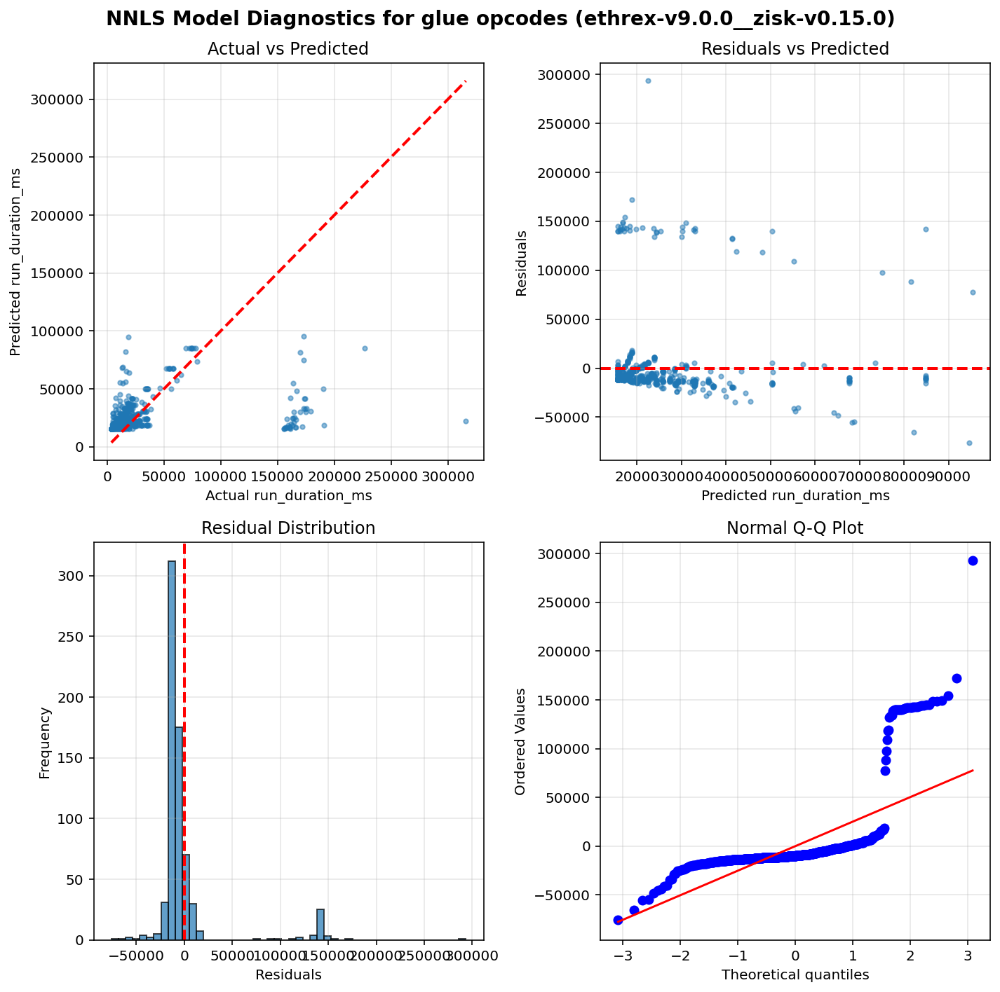
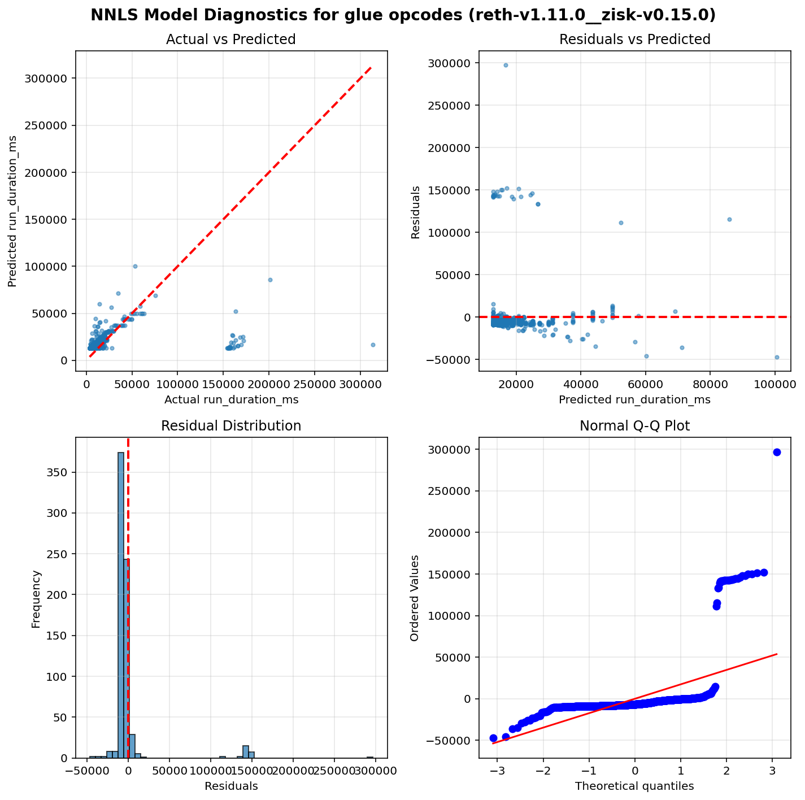

Operation run times estimation results - Glue opcodes
=====================================================

Table of contents
=================

* [ethrex-v9.0.0__zisk-v0.15.0](#ethrex-v900__zisk-v0150)
* [reth-v1.11.0__zisk-v0.15.0](#reth-v1110__zisk-v0150)

# Introduction


This is an automated report generated from the opcode run times
estimation script `./src/glue.py`. The script
uses data generated by running the
[EEST benchmark suite](https://github.com/ethereum/execution-spec-tests/tree/main/tests/benchmark)
with the [Nethermind benchmarking tooling](https://github.com/NethermindEth/gas-benchmarks).

The data includes all the tests for glue operations repriced in EIP-zkevm run
between 2026-03-15 and 2026-03-21.

## What is a glue opcode?


A **glue opcode** is an opcode whose execution count scales proportionally with the count of
a target opcode under test. Concretely, an opcode is classified as a glue opcode for a given
test if its execution count has a Pearson correlation ≥ 0.95 with the target opcode count
across different test parameter values, and its average count per target opcode execution
is at least 0.0005. Self-correlations are excluded. This identification is done automatically
from opcode-level execution traces.

The glue opcode set is also expanded transitively: if opcode A is a glue opcode for a target,
and opcode B is a glue opcode for A, then B is also included. This captures indirect
dependencies in the benchmark scaffolding.

**Why do glue opcodes matter?**

Because glue opcodes scale with the target opcode count, their runtime is absorbed into the
slope coefficient when regressing total test execution time on target opcode count. Without
correction, the slope overestimates the target opcode's per-execution runtime. The glue opcode
runtimes estimated in this report are used to compute a **glue adjustment** — a correction
subtracted from each target opcode's slope to remove the contribution of glue opcodes.

## How glue opcode runtimes are estimated?


**Non-Negative Least Squares (NNLS) Linear Regression** is used to estimate glue operation runtimes.
This model ensures all coefficients are non-negative, which is physically meaningful since
execution time cannot be negative.

Unlike the per-opcode models used for target operations, glue opcodes are estimated using a
**single model per client** that fits all glue opcode counts as features simultaneously. This means
the model estimates the runtime coefficients of all glue opcodes at the same time by solving:

`runtime = intercept + coef_1 × opcode_1_count + coef_2 × opcode_2_count + ... + coef_n × opcode_n_count`

where each `coef_i` represents the estimated per-execution runtime of the corresponding glue opcode.
This joint estimation approach accounts for correlations between glue opcode counts across tests,
producing more accurate estimates than fitting each glue opcode independently.

Only warm CALL variants are included in the model (cold CALL tests are excluded).

## Model Quality Metrics


Each model reports two key metrics to assess the quality of the fit:

**R² (R-squared / Coefficient of Determination)**
- Ranges from 0 to 1 (or can be negative for very poor fits)
- Measures how well the model explains the variance in the data
- **Interpretation**:
  - R² > 0.9: Excellent fit - the model explains >90% of the variance
  - R² > 0.7: Good fit - the model captures most of the relationship
  - R² > 0.5: Acceptable fit - the model has predictive power but notable variance remains
  - R² < 0.5: Poor fit - the model may not be reliable

**p-value**
- Tests the statistical significance of each coefficient, based on a bootstrap sample estimation
- **Interpretation**:
  - p < 0.05: Statistically significant - the parameter has a real effect on runtime
  - p ≥ 0.05: Not significant - the parameter's effect cannot be distinguished from random noise

We also plot some diagnostic graphs for each operation and client combination to visually assess the model fit.

# ethrex-v9.0.0__zisk-v0.15.0


```python
==============================================================================
                           NNLS Regression Results                            
==============================================================================
Dep. Variable:          run_duration_ms              R-squared:          0.110
Model:                  NNLS                    Adj. R-squared:          0.070
No. Observations:       682                               RMSE:       37236.07
Df Residuals:           652                                MAE:       18200.28
Df Model:               29     
==============================================================================
                      coef     std err     P-value      [0.025      0.975]
------------------------------------------------------------------------------
         const  15782.3779   2177.8566       0.006  11676.0933  19075.3258
         DUP14      0.0000      0.0000       1.000      0.0000      0.0000
  CALLDATACOPY      0.0081      0.0035       0.039      0.0000      0.0146
        PUSH32      0.0067     32.1285       0.004      0.0038      0.0076
          JUMP      0.0069      0.0101       0.360      0.0000      0.0345
  CALLDATALOAD      0.0000      1.7690       1.000      0.0000      6.2493
          DUP2      0.0078     78.5857       0.114      0.0000      0.0213
         PUSH0      0.0000      0.0000       1.000      0.0000      0.0001
         DUP12      0.0000      0.0000       1.000      0.0000      0.0000
           GAS      0.0014      0.0012       0.063      0.0000      0.0048
        PUSH20      0.0039      0.0007       0.013      0.0018      0.0046
          DUP5      0.0004      0.0053       0.409      0.0000      0.0078
          DUP8      0.0058      0.0045       0.392      0.0000      0.0137
          DUP4      0.0000      0.0000       1.000      0.0000      0.0000
         PUSH1      0.0007      0.0011       0.295      0.0000      0.0039
      JUMPDEST      0.0006      0.0002       0.035      0.0000      0.0008
         DUP16      0.0026      0.0049       0.354      0.0000      0.0169
          DUP6      0.0000      0.0000       1.000      0.0000      0.0000
         DUP13      0.0000      0.0000       1.000      0.0000      0.0001
         PUSH2      0.0000      0.0001       1.000      0.0000      0.0005
    STATICCALL      0.0000      0.1384       1.000      0.0000      0.4660
         DUP15      0.0047      0.0075       0.126      0.0000      0.0207
         DUP11      0.0000      0.0000       1.000      0.0000      0.0000
          DUP1      0.0000      0.0009       1.000      0.0000      0.0027
         DUP10      0.0000      0.0000       1.000      0.0000      0.0000
          DUP3      0.0000    193.5840       1.000      0.0000      0.0001
          DUP9      0.0079      0.0063       0.139      0.0000      0.0190
  CALLDATASIZE      0.0000      0.0001       1.000      0.0000      0.0002
           POP      0.4178      0.1537       0.124      0.0000      0.5700
          DUP7      0.0000      0.0000       1.000      0.0000      0.0000
==============================================================================
Notes: Non-negative least squares with bootstrap inference (1000 iterations)
==============================================================================
```




# reth-v1.11.0__zisk-v0.15.0


```python
==============================================================================
                           NNLS Regression Results                            
==============================================================================
Dep. Variable:          run_duration_ms              R-squared:          0.081
Model:                  NNLS                    Adj. R-squared:          0.041
No. Observations:       701                               RMSE:       30544.48
Df Residuals:           671                                MAE:       11829.27
Df Model:               29     
==============================================================================
                      coef     std err     P-value      [0.025      0.975]
------------------------------------------------------------------------------
         const  12875.3810   1744.9027       0.004   9419.6053  15626.8826
         DUP14      0.0000      0.0000       1.000      0.0000      0.0001
  CALLDATACOPY      0.0034      0.0020       0.026      0.0000      0.0079
        PUSH32      0.0069    179.8303       0.001      0.0037      0.0077
          JUMP      0.0000      0.0000       1.000      0.0000      0.0000
  CALLDATALOAD      0.0000      2.0331       1.000      0.0000      6.5704
          DUP2      0.0000     69.8602       1.000      0.0000      0.0001
         PUSH0      0.0000      0.0001       1.000      0.0000      0.0003
         DUP12      0.0000      0.0000       1.000      0.0000      0.0001
           GAS      0.0009      0.0009       0.055      0.0000      0.0036
        PUSH20      0.0089      0.0052       0.003      0.0025      0.0199
          DUP5      0.0000      0.0000       1.000      0.0000      0.0001
          DUP8      0.0000      0.0000       1.000      0.0000      0.0001
          DUP4      0.0000      0.0000       1.000      0.0000      0.0001
         PUSH1      0.0000      0.0000       1.000      0.0000      0.0001
      JUMPDEST      0.0001      0.0001       0.200      0.0000      0.0003
         DUP16      0.0028      0.0048       0.326      0.0000      0.0169
          DUP6      0.0000      0.0000       1.000      0.0000      0.0001
         DUP13      0.0048      0.0047       0.359      0.0000      0.0161
         PUSH2      0.0018      0.5013       0.258      0.0000      0.0136
    STATICCALL      0.0000      0.0722       1.000      0.0000      0.1654
         DUP15      0.0000      0.0000       1.000      0.0000      0.0001
         DUP11      0.0000      0.0000       1.000      0.0000      0.0000
          DUP1      0.0000      0.0001       1.000      0.0000      0.0001
         DUP10      0.0000      0.0000       1.000      0.0000      0.0001
          DUP3      0.0027    108.6027       0.311      0.0000      0.0191
          DUP9      0.0000      0.0000       1.000      0.0000      0.0001
  CALLDATASIZE      0.0011      0.0005       0.001      0.0003      0.0021
           POP      0.1492      0.0722       0.353      0.0000      0.1696
          DUP7      0.0000      0.0000       1.000      0.0000      0.0001
==============================================================================
Notes: Non-negative least squares with bootstrap inference (1000 iterations)
==============================================================================
```



